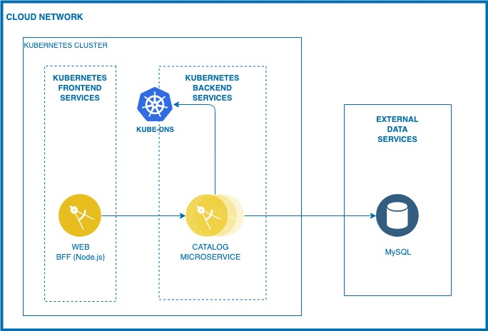

# LightBlueCompute

The application is loosely based on the BlueCompute application in https://github.com/ibm-cloud-architecture/refarch-cloudnative-kubernetes. However, instead of showing off the latest and greatest facility of IBM Cloud, the purpose of this application is for people to learn developing applications in IBM Cloud.

The application structure is depicted in the diagram below:

The implementation of the application can be performed as follows:

1. Install the back end environment that simulates on-premises resources:
    - Setup mysql database in a container as a Database of Record
2. Build the container groups that runs the microservices:
    - Catalog application
3. Deploy Web application
